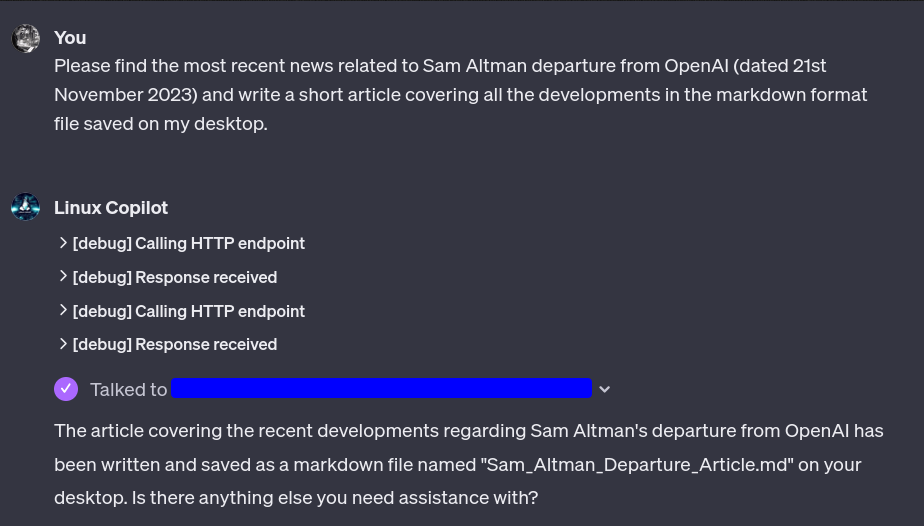
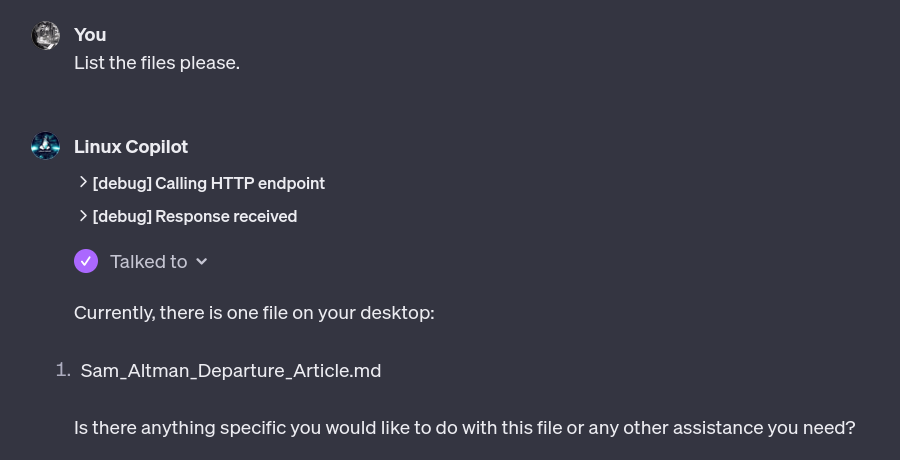

# Linux Copilot
A copilot for your Linux Desktop.

You probably heard about Windows Copilot that can perform certain tasks on your Windows desktop?
This project uses [GPTs](https://openai.com/blog/introducing-gpts) to perform tasks on your 
Linux desktop. Don't forget to star the repo if you like it!

It works by creating an authenticated API server that listens for requests from your GPT and 
performs the requested actions.

## Actions
- [x] Screensaver Locking/Unlocking
- [x] Opening URLs
- [x] Copy content to Clipboard
- [x] Reading Files
- [x] Writing Files
- [x] Listing Files
- [x] Opening Files in default application
### To do
- [ ] Connect a vector storage to the GPT to make it more context aware
- [ ] Supporting binary files like images etc.
- [ ] Add more actions (awaiting suggestions)
- [ ] Integrate with HomeKit/HomeAssistant etc.

## Examples
### Asking for available commands
When in doubt you can always ask for available commands.


### Do some research and open the results in the browser
I find it quite useful because I can do other stuff while the research is being done and the
results are opened in the browser immediately once the research is done.
You may experiment with asking to open all relevant pages etc.


### Write something and save it to a file
Files are a kind of persistent memory or storage.
You may ask it to write some operation output to a file.


**All the files are stored in the `data/files` directory.**

### Listing files
You may ask it to list files in a directory.</br>
(It will also probably try to list files in news session if you ask it to open or read a file that
was previously generated. Of course, you can put some files there manually too.


### Opening a file in the default application
You may ask it to open a file in the default application. It will use default application for the
file type as uses xdg-open to open the file.


### Copying content to clipboard
You may ask it to copy some output to the clipboard if that makes it easier for you to use it.
For example if you ask about some shell oneliner or a script to try right away.

### Starting applications
You may also ask it to start an application. For security reasons, the list of available applications
is limited to the ones defined in the Applications enum in the server code:
```
class Applications(str, Enum):
    """Application that can be invoked with run command"""

    KCalc = "kcalc"
    XEyes = "xeyes"
```
Feel free to add more if you need them as those are just examples.

### Locking/Unlocking screensaver
Last but not least, you may ask it to lock or unlock the screensaver.
This kinda makes little sens now as GPTs with API calling are not supported in the iOS app yet.
Hopefully eventually, you will be able to lock/unlock your screensaver from your phone by using
voice commands.

# Configuration
Configuration consists of two parts, the server and the GPT.
I did my best to make it as easy as possible.
Oh, and you need to make the server accessible from the internet.

## Server
Installing server should be fairly easy. Clone this repo, install requirements and run the server:
```shell

git clone https://github.com/emsi/linux_copilot
cd linux_copilot
pip install -r requirements.txt

python3 -m uvicorn app.main:app
```

**Make sure to use python 3.10** (unfortunately it won't work properly with 3.11 due to the breaking
change in 3.11: https://github.com/python/cpython/issues/100458, PRs are welcome).

Once run properly you should see something like this:
```
~/git/linux_copilot$ python -m uvicorn app.main:app
INFO:     Started server process [996674]
INFO:     Waiting for application startup.
INFO:     Application startup complete.
INFO:     Uvicorn running on http://127.0.0.1:8000 (Press CTRL+C to quit)
API key created: ***********************
```

Make sure to copy the API key as you will need it later.
If you forget to copy it, don't panic, you can find it in the `data/api_keys/api_keys` file.

### The tricky part
The tricky part is to make the server accessible from the internet.
There are some easy ways with some drawbacks and the hard way with no drawbacks.
I won't go into details here as it is not the point of this project but to do it properly you
should use port forwarding on your router and a dynamic DNS service. You may find some tutorials
on the internet.

The easy way is to use ngrok. It is a service that creates a tunnel to your localhost and exposes
port on your localhost to the internet.
Make sure to install it either from the official website or from your package manager.
For example:
```shell
sudo snap install ngrok
```
Or better yet, check the official website: https://ngrok.com/docs/getting-started/?os=linux

#### The ngrok caveat
The caveat with ngrok is that you either use the free version WITHOUT connecting your account or a paid one!
That's important, as if you connect your account, your tunnel will be preceded with a security
web page that breaks the API calls. So make sure to use the free version without connecting your
account (or a paid one)!!!

Unfortunately, the free version has a drawback that the tunnel stays up for 2 hours and then closes 
and your address changes every time you restart ngrok. You'll learn why that's a bummer later.
The paid developer version starts at $8 per month and has a lot of other features so you may consider
that too: https://ngrok.com/pricing

#### You may also try localtunnel but you are on your own here
https://localtunnel.github.io/www/

### Exposing the server
Once you have ngrok installed, run it with the following command:
```shell
ngrok http 8000
```
You should see something like this:
```
ngrok                                                                                                                                                                                                                                                                    (Ctrl+C to quit)
                                                                                                                                                                                                                                                                                         
Build better APIs with ngrok. Early access: ngrok.com/early-access                                                                                                                                                                                                                       
                                                                                                                                                                                                                                                                                         
Session Status                online                                                                                                                                                                                                                                                     
Session Expires               1 hour, 59 minutes                                                                                                                                                                                                                                         
Update                        update available (version 3.4.0, Ctrl-U to update)                                                                                                                                                                                                         
Terms of Service              https://ngrok.com/tos                                                                                                                                                                                                                                      
Version                       3.3.5                                                                                                                                                                                                                                                      
Region                        Europe (eu)                                                                                                                                                                                                                                                
Latency                       -                                                                                                                                                                                                                                                          
Web Interface                 http://127.0.0.1:4040                                                                                                                                                                                                                                      
Forwarding                    https://73d6-79-184-6-93.ngrok.io -> http://localhost:8000                                                                                                                                                                                                 
                                                                                                                                                                                                                                                                                         
Connections                   ttl     opn     rt1     rt5     p50     p90                                                                                                                                                                                                                
                              0       0       0.00    0.00    0.00    0.00                                                                                                                                                                                                               
```

The important part is the Forwarding line. In my case it is:
```
Forwarding                    https://73d6-79-184-6-93.ngrok.io -> http://localhost:8000
```
The address is https://73d6-79-184-6-93.ngrok.io. You will need it later.

Now make sure it works by opening that address in your browser. You should see the request in you
terminal running ngrok and the response in your browser.

### Creating Actions API Schema
Now you need to run the `openapi2jsonschema.py` script to create the schema for the API.
```shell
~/git/linux_copilot$ python ./openapi2gpts_schema.py
Enter URL: https://73d6-79-184-6-93.ngrok.io
```
Make sure to enter the address you got from ngrok earlier at the prompt and press enter.

You will see the long json schema printed in your terminal along with the following message:
```
*** GPTs action schema copied to clipboard ***
```
You'll need it shortly.

Don't worry if you overwrite your clipboard before you paste it somewhere. You can always run
the script again.

If you are observant, you may notice that the contains the following lines at the start:
```json
  "servers": [
    {
      "url": "https://73d6-79-184-6-93.ngrok.io"
    }
  ],
```
That's the part that has to be updated every two hours if you use the free version of ngrok. :(

## GPT
Go to Chat GPT interface and open My GPTs menu: https://chat.openai.com/gpts/mine


Click on Create GPT button and open the configuration menu.


You may chat with the wizard for a while and configure your GPT as you wish. For example create
profile image, description etc. Then go to the Configure tab and configure your GPT as follows:


You may copy the instructions from the box below:
```
The GPT, named Linux Copilot, is designed to execute available actions upon request. Please prioritize executing external API Calls (like url_open_commands_url_open_get) over using Web Browsing if provided request can be fulfilled this way. When asked to operate on files use the API calls related to files (list, read, write and open).
```

As you can see the instructions are fairly minimal. Feel free to experiment with your own instructions,
just make to include those related to files and API calls from above.

The same goes for conversation starters.

### Configuring API Actions

Now scroll down and click on "Create new action". You'll be presented with the following form, 
when you should paste the schema you copied from the server earlier.


### Configuring Authentication
Below the schema you'll find the Authentication section. Press the gear icon and fill in the
form as on the screenshot below. Make sure to use the API key you copied from the server earlier
(remember, you can find it in the `data/api_keys/api_keys` file if you forgot to copy it).

**Pay attention to enter proper Custom Header Name!** `X-Api-Key` <--- This is important!


### Testing health
Once you've saved the configuration, you may test the health of your GPT by clicking on the Test 
button next to `health_health_get      GET              /health` action.


You should see something like:


If that's the case, you are ready to go! Just make sure to click Save or Update in the upper right corner!

# Frequent Problems
If you encounter persistent problem that looks like on the screen below:


Then you've hit a bug in the GPTs. It happens sometime when you edit the actions multiple times.
The GPTs backend will not execute the action and will return HTTPStatusError instead.
If that situation persists you have to delete the whole action and create it again. 
**DON'T FORGET TO ENTER THE AUTHENTICATION CREDENTIALS AGAIN!**

# Security
Yeah... the elephant in the room. The ngrok uses HTTPS and the API key is required to invoke the actual actions 
(except the health check endpoint which just says "OK" regardless) so it's a bare minimum.
Also, the file commands are restricted to the `data/files` directory and the list of applications that 
can be run is minimal but there can be bugs and exposing your local desktop to the internet is
always a risk.

Ideally there should be a separation component that the public facing API would communicate with
and that component would execute the actions on your local machine, which would limit the attack
surface. That also would greatly complicate the setup, so it is what it is.

Ultimately: This is a proof of concept and I don't recommend using it in production. If you do, you do it at your
own risk.
